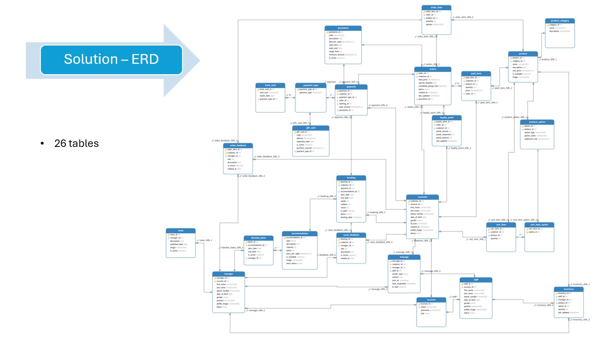
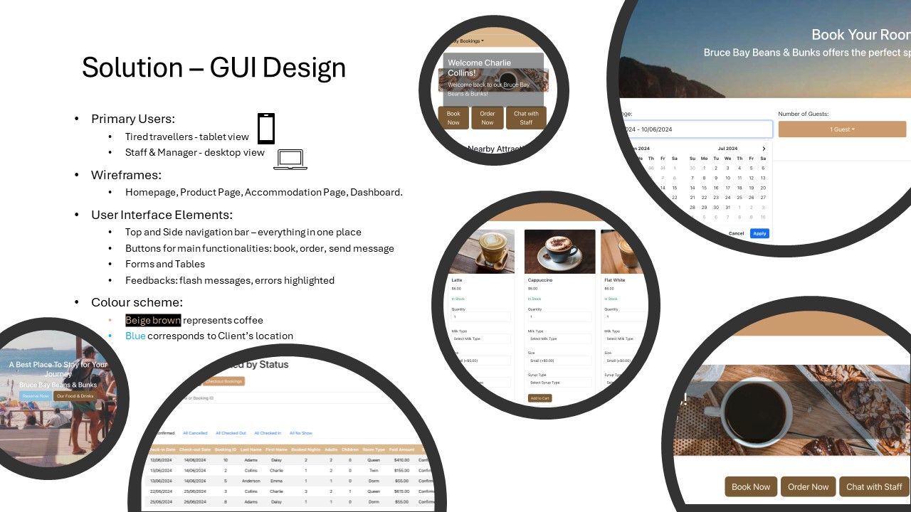
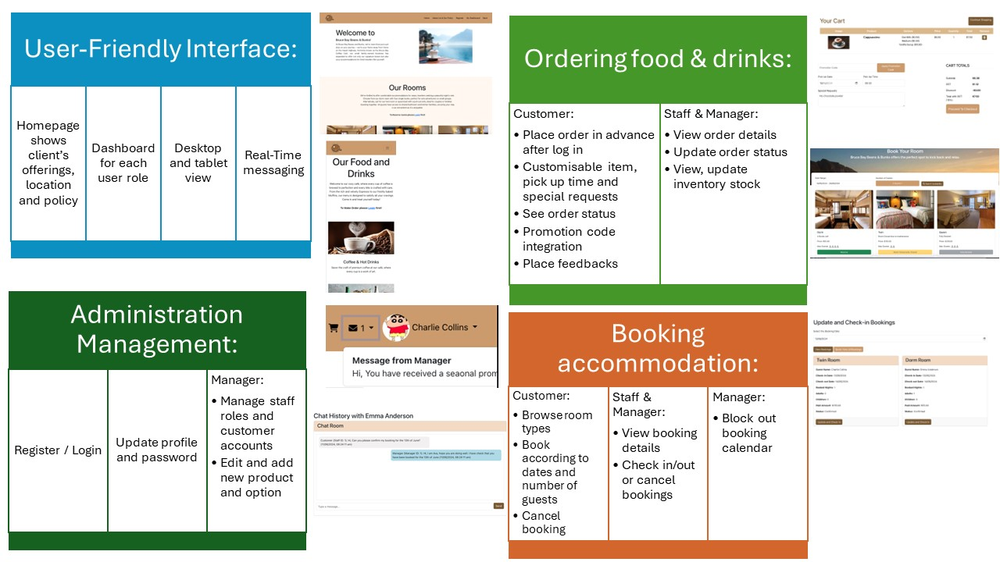

# COMP639S1_Group_ZZ - Bruce Bay Beans Bunks
- COMP639 Assignment 3 - Group Project 2
- Our team: Alex Zhao, Jun Su, Yingyue(Rita) Chen, Yiding(Ivy) Yang, Li Chen
- Student ID: 1156956, 1159009, 1126418, 1135118, 1158162

## Project Description
- Client: Bruce Bay Beans Bunks
- Project Overview: The current model hinders client’s wish to expand their business. Without an online system, customers are limited to placing orders in person at the shop, which is inconvenient for tired tourists who prefer to pre-order their coffee and snacks. Additionally, managing accommodation becomes cumbersome and inefficient.
- Vison and Misson of this project: 
    - An online system for managing food and drink orders and accommodation bookings. 

## Assumptions and design decisions
- General: 
    1. Visitors can visit the homepage to browse foods and accommodation options, but need to register and login to order drinks or book rooms. They then become our customers.
    2. The promotion code 'WINTER2024' can be used for orders but does not apply to accommodation bookings.
    3. All paid food items are non-refundable
   
- Customer Bookings:
    1. Accommodation fee need to be fully prepaid upon booking.
    2. Bookings canceled within 24 hours of check-in will be charged in full. A full refund is provided for bookings canceled 24 hours or more prior to arrival.
    3. Database: If a customer cancels a booking, a new payment record will be inserted to the payment table with a negative amount to ensure the account balance.
    4. Confirmed bookings where the customer does not show up until the check-out date will be marked as no-shows.

- Staff/manager check-in Bookings:
    1. If the check-in date is not today, check-in is not allowed.
    2. Customer must bring ID to check in, staff/manager should be able to update customer's name, birthday, and ID number upon check in.
    3. The check-in date can be postponed within the booked period in case of a late check-in as the accommodation fee has been fully paid, however Check-out date cannot be changed. Customers can make a new booking if they want to extend the stay.
    4. Staff/manager can select a future date to view bookings or update customer information prior to customer's arrival, but the check-in tick box is hidden for future bookings. 

- Manager block rooms:
    1. Rooms with confirmed bookings cannot be blocked.

## Our ERD

## GUI Decision

- The main objectives of this web application is:
    1. To be user-friendly: Top and side bar can navigate and interact with the application effortlessly.
    2. To align with a seaside, coffee shop, and accommodation theme: Making it visually appealing and cohesive with the thematic elements.
    3. To provide prompt feedback for user operations: Flash messages ensuring users receive immediate responses to their actions, enhancing the user experience.
    4. Colour scheme: We chose brown as the main color scheme, using different shades of brown and light blue corresponds to Client’s location that enhance the visual design. We used Bootstrap for navigation components and grid systems, and CSS for adjusting padding, spacing, and color.

## Project Delivery
- We have completed 100% of highest/high and medium priority user stories and a few low/lowest priority user stories.
- Our Final Feature to be delivery:

- Our Porject Key and Highlighted point: 
    1. Real time update and search.
    2. Booking and Block date system.
    3. Order, manage inventory and product system.
    4. A visually appealing UI.
    5. Easy to use.

## Web Application Structure
1. The Web structure used blueprint by 'auth', 'guest', 'manager', 'staff' and 'customer'.
2. `/templates`: This directory contains HTML templates for rendering views. It is organized by role or function.
    - `/dashboard`
        - `xxx.html`
            (....)
    - `/manager`
        - `xxx.html`
            (....)
        - (for more please refer to our templates folder, additional directories and templates for other views)
    - `/static`: This directory contains static files such as CSS stylesheets and images.
        - `/product`
            (....)
        - (for more please refer to our static folder)
      - `/css`: This directory contains CSS files for styling the web pages.
3. The navigation bars in the homepage and dashboard are separately included for modularity and easier management.

## Getting Started
- Please refer to `requirements.txt` for the necessary dependencies to install.
- Our web application is developed using technologies such as JavaScript, CSS, Python, Bootstrap, MySQL, etc.

## Demo
- Please visit the Bruce Bay Beans Bunks web application to see our project in action.
- ([PA LINK TO BE HERE](https://junsunujuss.pythonanywhere.com/))

- Manager account:aa@gmail.com
- Password:Password01.

- Staff account:bb@gmail.com
- Password:Password01.

- Customer account:cc@gmail.com
- Password:Password01.

- Reset Password:Password123.
